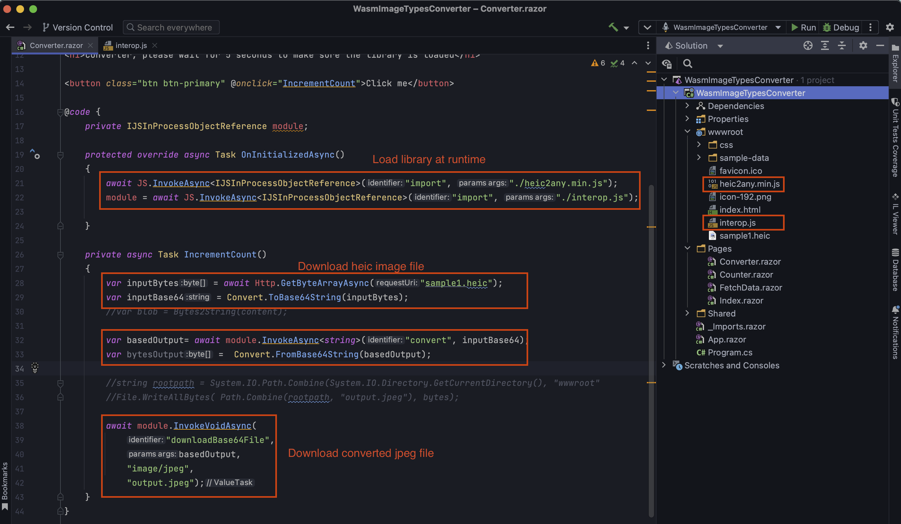

# WasmImageTypesConverter

A sample to convert HEIC to JPEG using a JS library in C# Blazor Webassembly - WASM project.
- At this moment, .NET WASM doesn't have good library to help us convert images from type to type.
- So, it's better can we can leverage a JS library to do the job for us while still receiving the converted images in C#

